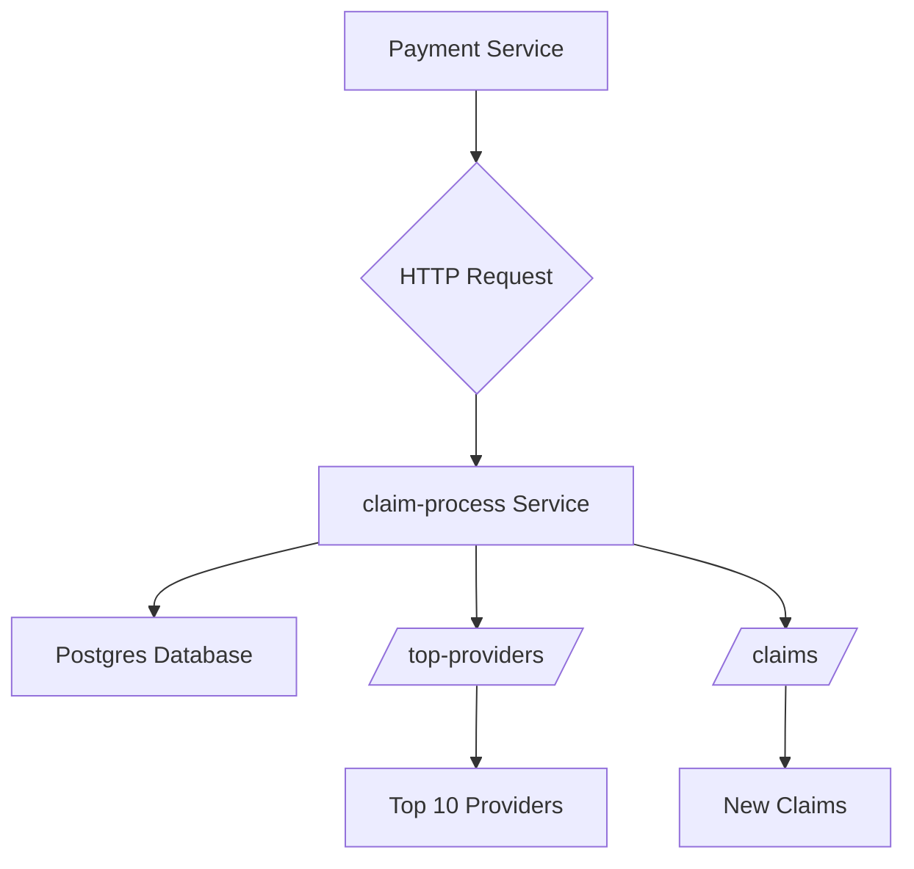
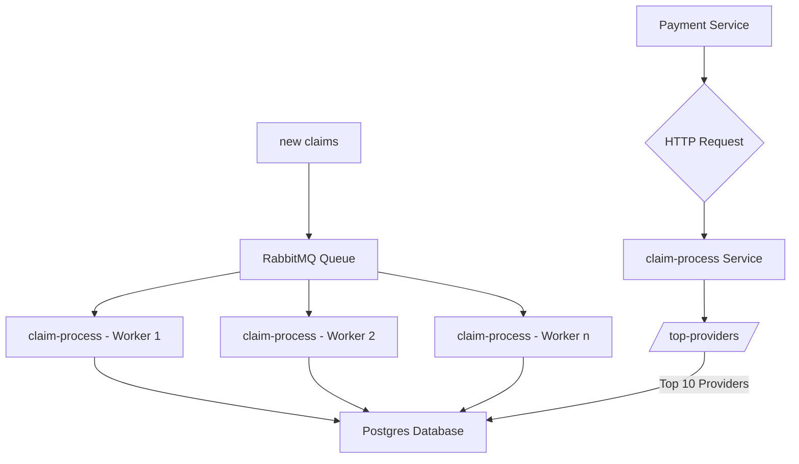

# Claim Process Service

This repository contains the Claim Process service that processes claims, handles the data and logic for claim submission. The service is built with **FastAPI** and follows modern development practices using Docker for containerization and **pytest** for unit testing.

## Running the Application

To get started with the project, you'll need Docker and Docker Compose installed. The application runs in containers, and the following commands can help you manage the development environment.

### Prerequisites

- [Docker](https://www.docker.com/get-started) and [Docker Compose](https://docs.docker.com/compose/)
- Python 3.10 or above (for development and debugging)

### Start the Services

To start the containers, run the following command:

```bash
make up
```

This will start all necessary containers in detached mode (in the background).

Visit [http://localhost:8000/docs](http://localhost:8000/docs) and press the `Try it out` button to play with the APIs.

### Running Unit Tests

To run the unit tests for the `claim_process` service, use the following command:

```bash
make test
```

To run tests for a specific file, specify the file path as an argument:

```bash
make test file=tests/test_claim.py
```

### Debugging with `ipdb`

To debug the service with `ipdb`, insert breakpoints where you want to inspect the code:

```bash
import ipdb; ipdb.set_trace()
```

And then execute the tests with: `make test`.

## Future Source code optimizations
* Add [black linting](https://github.com/psf/black)
* Replace `requirements.txt` with Pipenv (https://docs.pipenv.org/). The lock file will ensure specific versions of each package are used.
* Utilize GitHub Actions to automate unit tests and coverage checks for every pull request. Implement branch protection rules to block merges if the tests fail or coverage thresholds are not met.

## Future Architecture Optimizations

### Current Architecture
At the moment, there are two primary endpoints:
1. `/top-providers/`:
    * This endpoint retrieves the top 10 providers (by their `provider_npi`) based on the total net fees generated.
    * It performs a query that groups the claims by `provider_npi` and sums the net_fee for each provider, ordering the results by the highest sum.
    * This is then returned as a list of the top 10 providers.
2. `/claims`:
    * This endpoint is used for inserting new claims into the database.
    * Each claim will have a calculated `net_fee`, and this data is inserted into the database in real-time when an HTTP request is made.

### Challenges with the Current Architecture

* `Database Load:` When claims are inserted via HTTP requests, the database could face heavy traffic, especially during high-volume periods. This might lead to slow performance or database failures, especially if multiple simultaneous requests are made.
* `Real-time Insertions:` Each time a claim is added, the calculation for the `net_fee` is performed and the result is immediately written to the database. However, if the claim processing service (`claim-process`) is down or experiences a bottleneck, requests could fail or data could be lost.

### Diagram of current architecture


### Proposed Solution

#### Use of RabbitMQ for Asynchronous Processing
* Instead of having an endpoint that directly writes to the database, we can leverage RabbitMQ for asynchronous message processing. Here's how it could be implemented:
    * Instead of sending the claims directly to the database via the `/claims` endpoint, we can send them to a RabbitMQ queue.
    * The message will contain the claim details, including the necessary data (such as the net_fee).
    * A separate worker service (a consumer) will read from the queue, process the claim, and write the results to the database. This decouples the real-time HTTP requests from the database write operations, enabling better load distribution.
    * Multiple consumes could run in paraller and process a large volume of claims more efficiently.
    * If the claims processing service goes down, RabbitMQ can buffer messages until the service comes back online, reducing the risk of data loss.


